# hardReset — CODEKILL

> **Among Us × Competitive Coding** — A cyberpunk multiplayer browser game where coders complete coding tasks to earn points while an Impostor sabotages the room.

---

## What Has Been Built

### Pages (Routes)
- **`/` — Home** — Landing screen with animated hero copy, feature bullets, and a call-to-action
- **`/login` — Login** — Username + color picker, coding topic selector, room-code join/create flow
- **`/lobby` — Lobby** — Pre-game waiting room showing connected players, host controls, and ready state
- **`/playing` — Playing** — Live Phaser 3 game canvas with HUD overlay (role banner, task counter, ability charge)
- **`/discussion` — Discussion** — Post-kill emergency meeting: activity log, chat box, AI suspicion reports
- **`/results` — Results** — Round-end ejection screen + scoreboard summary
- **`/controller` — Controller** — Mobile gamepad overlay for touch input
- **`/game` — Game Route** — Phaser canvas host component

### UI Components

| Component | Purpose |
|---|---|
| `SplineModel.tsx` | 3-D animated background (Spline iframe, 140×140%, screen blend mode) |
| `TypewriterText.tsx` | Types/deletes a word in a loop with a blinking block cursor |
| `Crewmate.tsx` | Pixel bean avatar rendered in player colour |
| `PlayerHUD.tsx` | Top HUD bar — room code, role, task progress, timer |
| `TaskModal.tsx` | Coding puzzle modal (triggered from task stations) |
| `AbilityBar.tsx` | Impostor ability charge & activate button |
| `ActivityLog.tsx` | Scrolling room-event feed |
| `ChatBox.tsx` | In-meeting text chat |
| `AIReport.tsx` | AI-generated suspicion report per player |
| `MeetingPopup.tsx` | Emergency meeting announcement overlay |
| `VotingPanel.tsx` | Voting interface with live vote counts |
| `EjectionScreen.tsx` | Space ejection cinematic (6 s) → navigates to next phase |
| `EndScreen.tsx` | Win / loss reveal screen |

### Phaser 3 Game Engine

| File | Purpose |
|---|---|
| `PreloadScene.ts` | Asset preload + canvas texture generation |
| `MainScene.ts` | Top-down movement, tile maps, task stations, portals, multi-room |
| `HUDScene.ts` | Phaser HUD overlay (room label, proximity prompts) |
| `MeetingScene.ts` | Emergency meeting pause scene |
| `Player.ts` | Local player: canvas-drawn bean sprite, WASD/arrow movement, animation, name label |
| `RemotePlayer.ts` | Network-synced remote player using same texture pipeline |
| `TaskStation.ts` | Interactable station with proximity detection |
| `GameEventBus.ts` | Phaser → React event bridge (typed enum events) |
| `PhaserGame.tsx` | React wrapper that boots/destroys the Phaser game instance |

### State & Data

- **`gameStore.ts`** — Zustand global store: player list, game phase, task progress, votes, chat, AI reports, ability points, ejection state, round results
- **`useSocket.ts`** — Socket.IO hook: singleton connection, all server→client event handlers, player normalisation
- **`anim.ts`** — Shared Framer Motion variants (`fadeDown`, `fadeUp`, `scaleIn`, `slideInLeft`, `stagger`, `fadeScalePresence`) + GSAP helpers (`startGlitch`, `startNeonPulse`)
- **`mockData.ts`** — Dev-time mock players, activity log, and chat messages

### Smart Contract (Blockchain)

- **`blockchain/thirdweb-contracts/`** — Hardhat project with `Contract.sol`, deploy scripts, and verification scripts (thirdweb / Hardhat toolchain)

### Styling System

- **Press Start 2P** pixel font loaded globally
- Custom CSS utilities in `app.css`:
  - `.scanlines` — CRT horizontal-line overlay
  - `.scan-sweep` — glowing green line that sweeps top → bottom
  - `.neon-flicker` — irregular opacity flicker keyframe
  - `.bg-grid` — subtle purple grid background pattern
  - `caret-blink` — blinking block cursor keyframe for TypewriterText

---

## Problems Solved

| # | Problem | Fix Applied |
|---|---|---|
| 1 | Spline model too small / scene clipped | Scaled iframe to 140×140% with −20% inset offset so scene fills background |
| 2 | Dialog left-aligned on all pages | Replaced `justify-start` + `pl-8 lg:pl-16` with `justify-center` + `px-6` on Home, Login, Lobby |
| 3 | No animations on any page | Created `app/lib/anim.ts` with spring variants, installed GSAP, applied Framer Motion `motion.*` wrappers + stagger containers across all three pages |
| 4 | Text too small to read | Bumped all font sizes (body `text-[7-10px]` → `text-[11-15px]`, title `text-3xl` → `text-4xl`) |
| 5 | Animations finished too fast | Halved spring stiffness values, increased `staggerChildren` delays |
| 6 | No title animation | Built `TypewriterText.tsx` — type → pause → delete → repeat loop; wired to the `hardReset` and `CODEKILL` headings |
| 7 | `startGlitch is not defined` runtime crash | Removed stale `useRef` + `useEffect(() => startGlitch(...))` that survived a copy-paste refactor in Home.tsx and Login.tsx |
| 8 | TypeScript `type: string` not assignable to `AnimationGeneratorType` | Added `as const` to every `type: 'spring'` literal inside variant transition objects in `anim.ts` |
| 9 | `Property 'topics' does not exist on type 'Player'` in Lobby.tsx | Added `topics?: string[]` to the `Player` interface in `gameStore.ts` |
| 10 | Scan-sweep line barely visible and starting mid-screen | Set `top: 0`, raised opacity to `0.22`, added `box-shadow` glow, tightened gradient centre value |
| 11 | `npm run dev` EPERM crash on OneDrive path | Confirmed builds (`npm run build`) work cleanly; dev server EPERM is an OneDrive file-lock issue unrelated to source code |

---

## Full Flowchart

```mermaid
flowchart TD
    A([Browser]) --> B["/ — Home Page"]

    B -->|Enter game| C["/login — Login Page"]
    C -->|Pick name, color, topics| D{Create or Join?}

    D -->|Create room| E["/lobby — Lobby\nHOST"]
    D -->|Join with code| F["/lobby — Lobby\nGUEST"]

    E & F -->|All ready → host starts| G["/playing — Playing"]

    subgraph PHASER ["⚙️ Phaser 3 Game Engine"]
        G --> H["PreloadScene\ngenerate textures"]
        H --> I["MainScene\nWASD movement · multi-room · portals"]
        I --> J["TaskStation\nproximity → open TaskModal"]
        I --> K["MeetingScene\nemergency call / body report"]
        I --> L["HUDScene\nroom label · nearby prompts"]
    end

    subgraph REACT_OVERLAY ["🖥️ React Overlay Layer"]
        G --- M["PlayerHUD\nrole · tasks · timer"]
        G --- N["AbilityBar\nImpostor ability"]
        G --- O["TaskModal\ncoding puzzle"]
        G --- P["EjectionScreen\ncinematic 6s"]
    end

    J -->|Solve puzzle| Q["markTaskDone\nZustand store"]
    K -->|GameEventBus → React| R["/discussion — Discussion"]

    R --> S["ActivityLog + ChatBox\n+ AIReport"]
    S --> T["VotingPanel"]
    T -->|Votes tallied| U{Majority vote?}

    U -->|Player ejected| V["EjectionScreen cinematic"]
    U -->|Skip / tie| W{Game over?}

    V --> W
    W -->|Coders finished all tasks\nor Impostor ejected| X["/results — Results\nEndScreen · stats"]
    W -->|Continue round| G

    X -->|Play again| B

    subgraph BACKEND ["🔌 Socket.IO Backend"]
        SRV["server.js\nrooms · players · events"]
    end

    C & E & F & G & R & T -.->|socket events| SRV
    SRV -.->|broadcast| C & E & F & G & R & T

    subgraph BLOCKCHAIN ["⛓️ Blockchain Layer (optional)"]
        SC["Contract.sol\nHardhat · thirdweb"]
    end

    X -.->|record result on-chain| SC
```



---

## Tech Stack

| Layer | Technology |
|---|---|
| Framework | React Router 7.12 (SSR) |
| UI | React 19 + TailwindCSS |
| Animations | Framer Motion + GSAP |
| Game Engine | Phaser 3.90 |
| State | Zustand |
| Realtime | Socket.IO (client + Node.js server) |
| 3-D Background | Spline (iframe embed) |
| Font | Press Start 2P (Google Fonts) |
| Smart Contract | Solidity + Hardhat + thirdweb |
| Build | Vite + React Router dev server |
| Container | Docker (Dockerfile included) |

---

## Quick Start

```bash
# Install dependencies
npm install

# Production build (recommended on OneDrive)
npm run build
npm run start

# Backend (separate terminal)
cd backend
npm install
node server.js
```

> **Note for OneDrive users:** `npm run dev` exits with EPERM because OneDrive locks `.react-router/` temp files during writes. Use `npm run build` instead — it exits cleanly with code 0.
